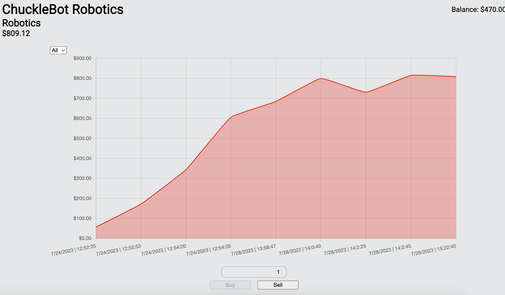

# 💶 Stock Investor 📈

*Stock Investor* is a simplified web trading game created with [Symfony](https://symfony.com/https:/) and [Svelte](https://svelte.dev/)

After creating an account, the player can browse the list of available companies, buy some shares and wait for the prices to change.

The goal is for the player to be able to predict how a company's price will evolve using technical analysis methods and, in the future, build a virtual news feed to introduce some fundamental analysis components.

